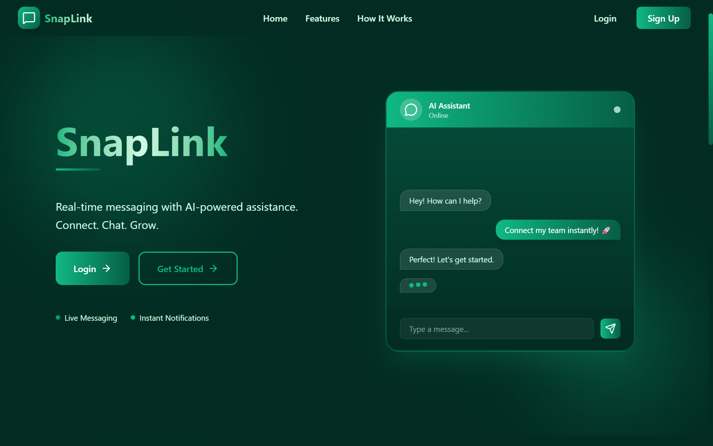
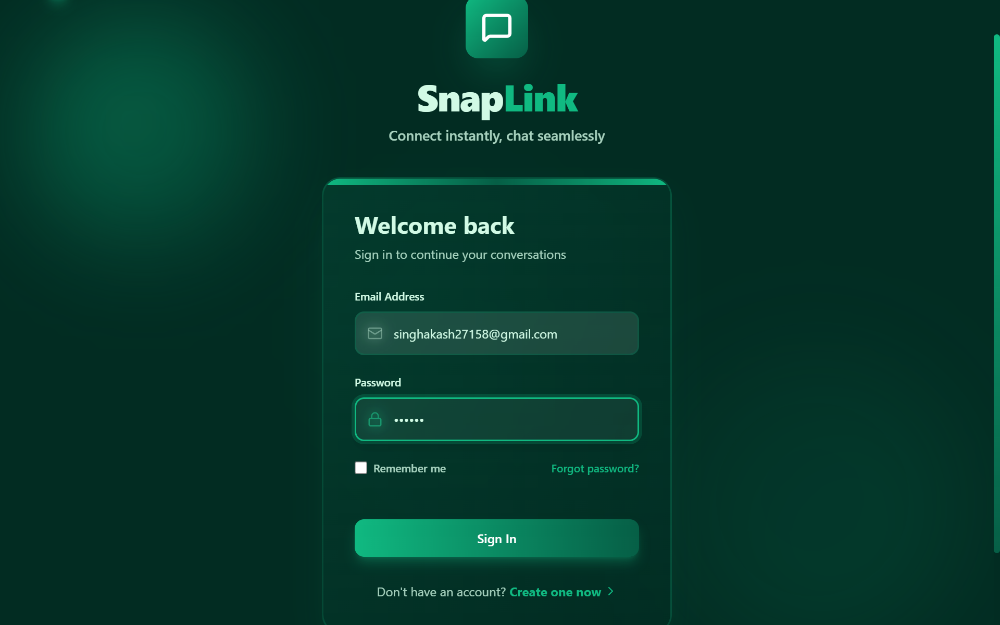
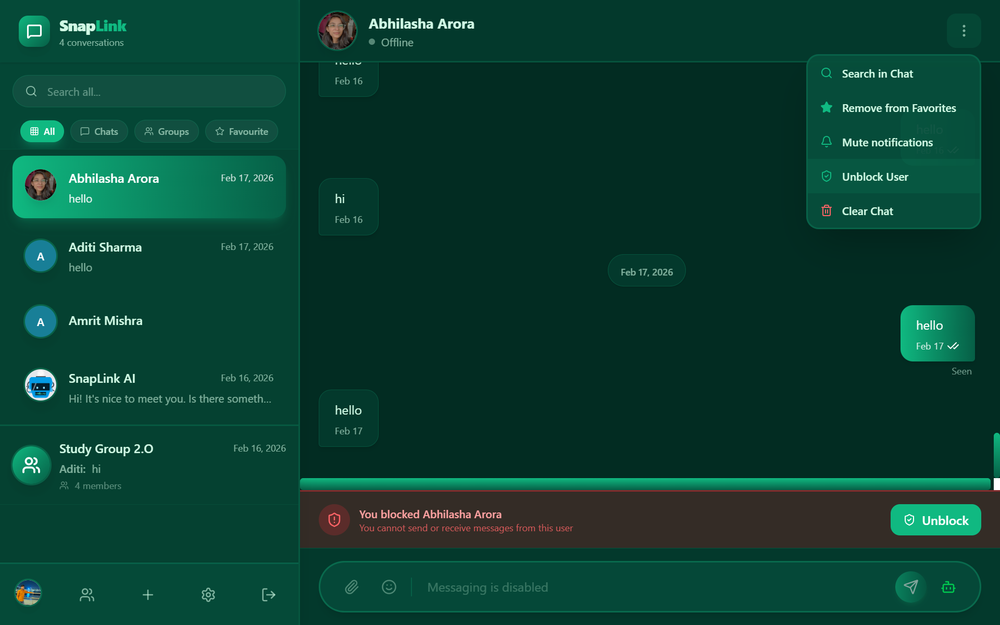
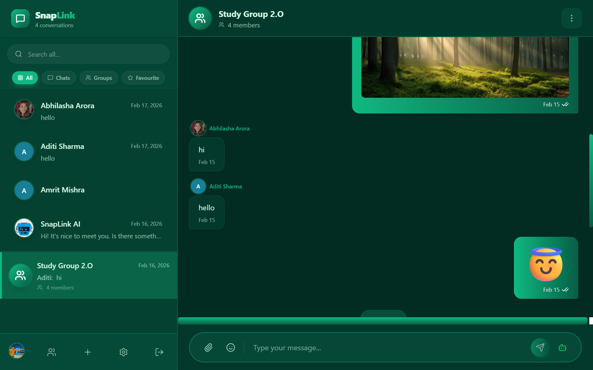
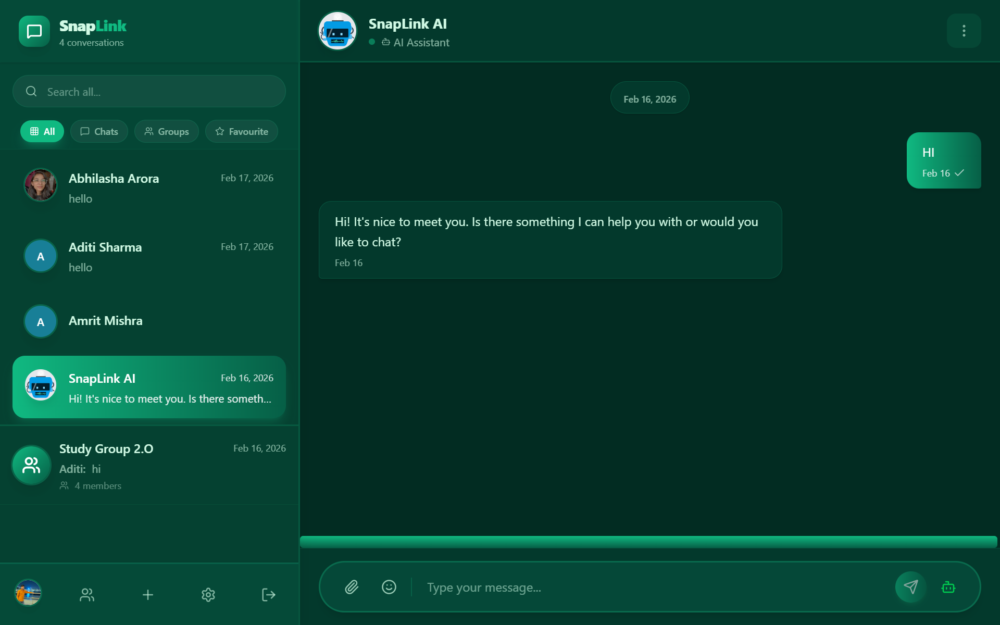

# 🚀 SnapLink

> A modern real-time messaging platform built with the MERN stack, featuring instant messaging, AI-powered conversations, browser notifications, and a responsive user experience.


---

# 📸 Project Screenshots

Explore the key features and user interface of **SnapLink**, a modern real-time messaging platform with AI-powered assistance.

---

## 🏠 Landing Page

A modern landing page introducing SnapLink's core features, AI-powered messaging, and responsive design.



---

## 🔐 Secure Authentication

Simple and secure authentication with **Remember Me**, **Forgot Password**, and responsive login experience.



---

## 💬 Real-Time Messaging

Instant one-to-one messaging with online status, message delivery indicators, reactions, search, favorites, and chat management.



---

## 👥 Group Conversations

Create and manage group chats with multiple participants, media sharing, and collaborative communication.



---

## 🤖 AI Assistant

Integrated AI assistant powered by **Ollama + Llama 3** to answer questions, assist users, and enhance conversations.



---

# ✨ Features

- 🔐 Secure JWT Authentication
- 💬 Real-Time Messaging using Socket.IO
- 🤖 AI Chat Assistant powered by Ollama + Llama 3
- ⚡ Optimistic UI Updates
- 😀 Emoji Reactions
- 🗑️ Delete Messages
- 🔔 Browser Notifications
- 🔊 Sound Notifications
- 🔕 Per-Conversation Mute
- ⚙️ User Preferences Persistence
- 📱 Fully Responsive Design
- 🚀 Fast React + Vite Frontend

---

# 🛠 Tech Stack

## Frontend

- React
- Vite
- JavaScript
- Tailwind CSS
- Socket.IO Client

## Backend

- Node.js
- Express.js
- Socket.IO
- JWT Authentication

## Database

- MongoDB
- Mongoose

## AI

- Ollama
- Llama 3

---

# 🏗 Architecture

```text
                User
                  │
                  ▼
        React + Vite Frontend
                  │
      REST API + Socket.IO
                  │
                  ▼
        Express + Node Backend
          │              │
          │              │
          ▼              ▼
      MongoDB       Ollama (Llama 3)
```

---

# 📂 Folder Structure

```text
SnapLink
│
├── frontend
│   ├── public
│   ├── src
│   │   ├── components
│   │   ├── pages
│   │   ├── layouts
│   │   ├── services
│   │   ├── hooks
│   │   └── utils
│
├── backend
│   ├── src
│   │   ├── controllers
│   │   ├── routes
│   │   ├── middleware
│   │   ├── models
│   │   ├── sockets
│   │   └── utils
│
└── README.md
```

---

# ⚙️ Installation

## Clone Repository

```bash
git clone https://github.com/Akash30112004/SnapLink.git
```

---

## Backend Setup

```bash
cd backend
npm install
npm run dev
```

---

## Frontend Setup

```bash
cd frontend
npm install
npm run dev
```

---

# 🔑 Environment Variables

Create a `.env` file inside the backend directory.

```env
PORT=

MONGO_URI=

JWT_SECRET=

CLIENT_URL=

OLLAMA_URL=http://localhost:11434
```

---

# 📡 API Endpoints

| Method | Endpoint | Description |
|---------|----------|-------------|
| POST | `/auth/register` | Register User |
| POST | `/auth/login` | Login User |
| POST | `/auth/logout` | Logout User |
| POST | `/auth/forgot-password` | Forgot Password |
| POST | `/messages` | Send Message |
| GET | `/messages/:conversationId` | Fetch Messages |
| DELETE | `/messages/:messageId` | Delete Message |

---

# 🚀 Performance Highlights

- Instant real-time messaging
- Optimistic UI updates
- Non-blocking AI responses
- Persistent user preferences
- Responsive across desktop and mobile devices
- Browser notification support
- Local AI inference using Ollama

---

# 🧠 Challenges Faced

- Maintaining correct message ordering across clients.
- Preventing duplicate Socket.IO events.
- Implementing optimistic UI without inconsistencies.
- Handling browser autoplay restrictions for notification sounds.
- Integrating local AI inference while keeping the chat responsive.

---

# 📚 What I Learned

- Building scalable real-time applications with Socket.IO.
- Implementing JWT-based authentication.
- Managing application state in React.
- Designing RESTful APIs using Express.js.
- Integrating local Large Language Models through Ollama.
- Working with MongoDB and Mongoose.
- Handling browser notification APIs and audio permissions.

---

# 🗺 Roadmap

- [ ] Group Chats
- [ ] Voice Messages
- [ ] Image/File Sharing
- [ ] Message Search
- [ ] Read Receipts
- [ ] Video Calling
- [ ] User Status (Online/Offline)
- [ ] End-to-End Encryption
- [ ] Progressive Web App (PWA)

---

# 📖 Documentation

Detailed implementation notes are available in:

```text
docs/IMPLEMENTATION.md
```

---

# 🤝 Contributing

Contributions are welcome!

1. Fork the repository
2. Create a new feature branch
3. Commit your changes
4. Push to your branch
5. Open a Pull Request

---

# 📄 License

This project is licensed under the MIT License.

---

# 👨‍💻 Author

**Akash Singh**

- GitHub: https://github.com/Akash30112004
- LinkedIn: https://www.linkedin.com/in/akash456/

---

⭐ If you found this project helpful, consider giving it a star.
